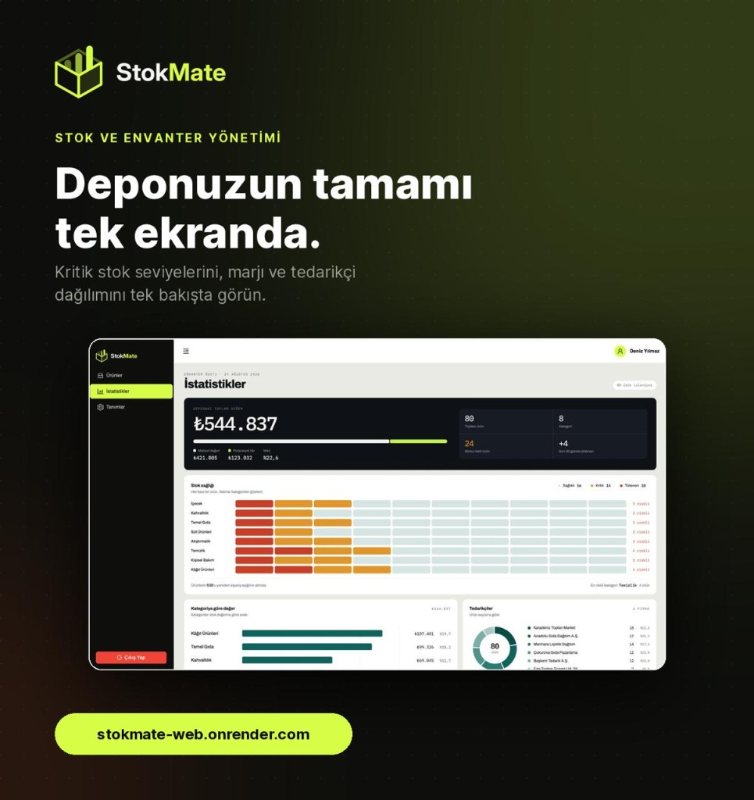

<div align="center">


<br />

**Envanter yönetim paneli** — ürün, kategori, marka ve tedarikçi verilerini tek ekrandan yönetin.


<br />

<picture>
  
</picture>

<sub>İstatistikler · Envanter özeti, stok sağlığı ve kategori dağılımı tek bakışta</sub>

</div>

---

## Özellikler

| Modül | Açıklama |
|:------|:---------|
| **Ürünler** | Arama, filtreleme, sıralama, yeni ürün ekleme, inline stok güncelleme |
| **Ürün Detay** | Birim ekonomisi, stok gauge, stok seyri grafiği, hareket logları |
| **İstatistikler** | Toplam değer, kategori dağılımı, kritik stok listesi, grafikler |
| **Tanımlar** | Kategori · Marka · Tedarikçi CRUD işlemleri, stok değeri özeti |
| **Auth** | JWT tabanlı giriş, access + refresh token yönetimi |

---

## Kurulum ve Çalıştırma

> **Gereksinimler:** Node.js ≥ 18 · npm veya yarn

```bash
# 1. Bağımlılıkları yükle
npm install

# 2. Ortam değişkenini ayarla (isteğe bağlı, varsayılan: http://localhost:5080)
cp .env.example .env
# VITE_API_BASE=http://localhost:5080

# 3. Geliştirme sunucusunu başlat
npm run dev

# 4. Production build
npm run build && npm run preview
```

| Komut | Açıklama |
|:------|:---------|
| `npm run dev` | Vite dev server (HMR) |
| `npm run build` | TypeScript kontrolü + production build |
| `npm run lint` | ESLint kontrolü |
| `npm run preview` | Build edilmiş dosyaları local serve |

---

## Proje Yapısı

```
src/
├── assets/             # SVG logolar, Lottie animasyonları
├── components/         # Paylaşılan UI bileşenleri
│   ├── AppDialog/      # Modal wrapper (tüm formlar için)
│   ├── ConfirmDialog/  # Silme onay diyaloğu
│   ├── CreatableSelect/# Select + "yeni ekle" butonu
│   ├── ErrorBoundary/  # React error boundary
│   └── dialogTheme.tsx # Form tema sabitleri, SegmentedPills, UnitEconomicsPanel
├── constants/          # Renk paleti, Ant Design tema config
├── hooks/              # Custom hooks (SSE product events)
├── layouts/            # Sidebar + Header + Content shell
├── pages/
│   ├── Login/          # Giriş sayfası + InventoryShowcase
│   ├── Products/       # Ürün listesi + yeni ürün + quick-create modaller
│   ├── ProductDetail/  # Ürün detay + düzenleme + stok girişi
│   ├── Statistics/     # İstatistik dashboard
│   ├── Definitions/    # Kategori · Marka · Tedarikçi yönetimi
│   └── NotFound/       # 404 sayfası
├── routes/             # React Router tanımları
├── services/           # API katmanı (axios instance + endpoint modülleri)
├── stores/             # Uygulama state
├── types/              # TypeScript type tanımları
└── main.tsx            # Uygulama giriş noktası
```

---

## Varsayımlar

- **API sunucusu hazır:** Backend `VITE_API_BASE` adresinde çalışıyor, REST endpoint'leri ve JWT auth altyapısı mevcut.
- **Tek depo modeli:** Uygulama tek bir depo üzerinden çalışır; çoklu depo desteği kapsam dışıdır.
- **Fiyatlar kuruş cinsinden:** Backend fiyatları kuruş (×100) olarak saklar; frontend TL gösterir ve gönderimde çevirir.
- **Türkçe arayüz:** Tüm metinler, validasyon mesajları ve URL slug'ları Türkçe'dir.
- **Masaüstü öncelikli, mobil uyumlu:** Tasarım öncelikle masaüstü için optimize, mobil breakpoint'lerde layout düzenlenir.
- **Tek kullanıcı oturumu:** Aynı anda tek bir aktif oturum varsayılır; multi-session yönetimi yoktur.
- **Tarayıcı desteği:** Güncel Chrome, Firefox, Safari ve Edge sürümleri hedeflenir.

---

## Kütüphane Tercihleri

| Kütüphane | Neden? |
|:----------|:-------|
| **React 19** | Concurrent rendering, hooks ekosistemi, geniş topluluk desteği |
| **TypeScript 6** | Compile-time tip güvenliği, IDE deneyimi, bakım kolaylığı |
| **Vite 8** | Anında HMR, hızlı cold start, ESM-native build pipeline |
| **Ant Design 6** | Üretim kalitesinde form bileşenleri (InputNumber, Select, Table), tema özelleştirme token sistemi |
| **Tailwind CSS 4** | Utility-first yaklaşım, hızlı prototipleme; karmaşık sayfalar inline style ile çözüldü |
| **React Router 7** | Client-side routing, nested layout desteği, korumalı route yapısı |
| **Axios** | İstek/yanıt interceptor'ları (token enjeksiyonu, 401 → refresh → retry zinciri) |
| **Recharts** | React-native SVG grafik kütüphanesi, responsive chart'lar, kolay özelleştirme |
| **Framer Motion** | Sayfa geçişleri ve mikro animasyonlar için deklaratif API |
| **AutoAnimate** | Liste ekleme/silme animasyonları tek satır `ref` ile, sıfır konfigürasyon |
| **React Toastify** | Hafif, özelleştirilebilir bildirim sistemi (başarı, hata, bilgi) |
| **jwt-decode** | Token expiry kontrolü, kullanıcı bilgisi çıkarma — ek bağımlılık yok |
| **Day.js** | Moment.js'e hafif alternatif; tarih formatlama ve locale desteği |
| **Lottie React** | JSON tabanlı animasyonlar (404 sayfası vb.) |

---

## Auth Akışı

```
┌─────────┐    POST /auth/login     ┌─────────┐
│  Login   │ ─────────────────────▶ │   API   │
│  Sayfası │ ◀───────────────────── │ Backend │
└────┬─────┘  { accessToken,        └────┬────┘
     │          refreshToken }            │
     ▼                                    │
  localStorage                            │
  ├── token                               │
  ├── refreshToken                        │
  └── user                                │
     │                                    │
     ▼                                    │
┌─────────────┐  Authorization: Bearer    │
│ Axios       │ ─────────────────────────▶│
│ Interceptor │                           │
│             │◀── 401? ──────────────────│
│             │                           │
│             │── POST /auth/refresh ────▶│
│             │◀── yeni token ───────────│
│             │── orijinal istek (retry)─▶│
└─────────────┘                           │
```

---

## Renk Paleti

| Renk | Hex | Kullanım |
|:-----|:----|:---------|
| 🟢 Primary | `#D7FE47` | Aksan rengi, butonlar, aktif durumlar |
| ⚫ Secondary | `#0E0F0C` | Ana metin, koyu arka planlar, sidebar |
| 🟠 Accent | `#FF5A1F` | Uyarılar, kritik stok göstergeleri |
| ⚪ White | `#FFFFFF` | Kartlar, ana arka plan |

---

<div align="center">

<sub>Salih Kuloğlu · 2026</sub>

</div>
